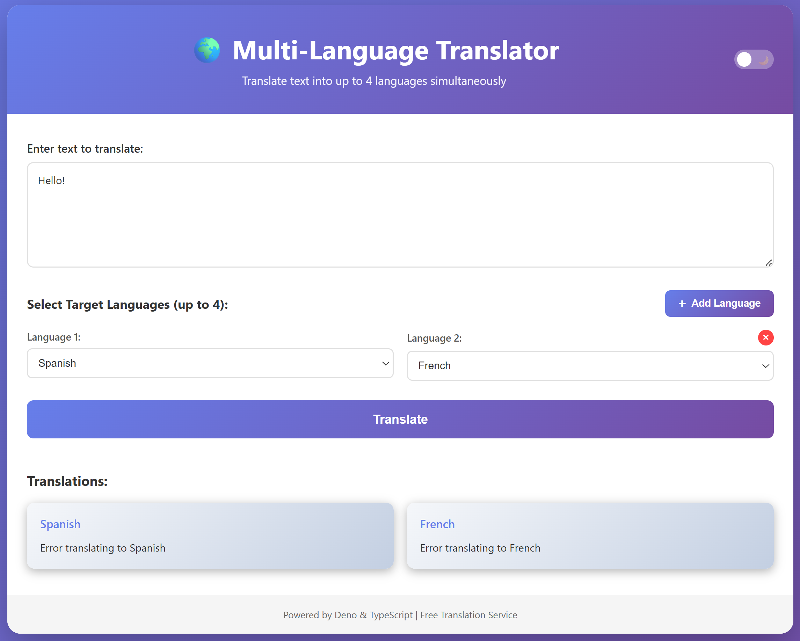

# 🌍 Multi-Language Translator

A modern web application that translates text into up to 4 different languages simultaneously. Built with Deno, TypeScript, and a free translation API.



## ✨ Features

- **Multi-Language Translation**: Translate text into up to 4 languages at once
- **35+ Languages Supported**: Including Spanish, French, German, Japanese, Chinese, Arabic, and many more
- **Modern UI**: Clean, responsive design that works on desktop and mobile
- **Real-time Translation**: Fast translation powered by Google Translate API
- **No API Key Required**: Uses a free translation library
- **TypeScript**: Fully typed for better development experience

## 🚀 Getting Started

### Prerequisites

- [Deno](https://deno.land/) installed on your system
  - Windows: `irm https://deno.land/install.ps1 | iex`
  - macOS/Linux: `curl -fsSL https://deno.land/install.sh | sh`

### Installation

1. Clone or download this repository
2. Navigate to the project directory:
   ```bash
   cd translation-app
   ```

### Running the Application

Start the development server:

```bash
deno task dev
```

Or run directly:

```bash
deno run --allow-net --allow-read --allow-env src/server.ts
```

The application will be available at: **http://localhost:3000**

## 📖 Usage

1. **Enter Text**: Type or paste the text you want to translate in the input area
2. **Select Languages**: Choose up to 4 target languages from the dropdown menus
3. **Translate**: Click the "Translate" button
4. **View Results**: See all translations displayed in separate cards

### Keyboard Shortcuts

- **Ctrl/Cmd + Enter**: Translate the current text

## 🌐 Supported Languages

The application supports 35+ languages including:

- **European**: English, Spanish, French, German, Italian, Portuguese, Russian, Dutch, Polish, Turkish, Swedish, Danish, Finnish, Norwegian, Czech, Greek, Romanian, Hungarian, Bulgarian, Croatian, Slovak, Slovenian, Lithuanian, Latvian, Estonian
- **Asian**: Japanese, Korean, Chinese (Simplified & Traditional), Thai, Vietnamese, Indonesian, Malay, Hindi
- **Middle Eastern**: Arabic, Hebrew

## 🛠️ Technology Stack

- **Runtime**: Deno
- **Language**: TypeScript
- **Translation API**: @vitalets/google-translate-api
- **Frontend**: HTML5, CSS3, Vanilla JavaScript
- **Server**: Deno's built-in HTTP server

## 📁 Project Structure

```
translation-app/
├── src/
│   ├── server.ts           # Backend server with translation API
│   └── public/
│       ├── index.html      # Frontend UI
│       ├── styles.css      # Styling
│       └── app.js          # Frontend logic
├── deno.json               # Deno configuration
└── README.md               # This file
```

## 🔧 Configuration

The server runs on port 3000 by default. To change the port, modify the `PORT` constant in `src/server.ts`:

```typescript
const PORT = 3000; // Change to your desired port
```

## 🚨 Error Handling

The application includes comprehensive error handling:

- **Input Validation**: Ensures text and languages are selected
- **Duplicate Detection**: Prevents selecting the same language multiple times
- **Translation Errors**: Gracefully handles API failures
- **User Feedback**: Clear error messages displayed to users

## 🎨 Features in Detail

### Translation API Endpoint

**POST** `/api/translate`

Request body:
```json
{
  "text": "Hello, world!",
  "targetLanguages": ["es", "fr", "de"]
}
```

Response:
```json
{
  "translations": [
    {
      "language": "es",
      "text": "¡Hola, mundo!",
      "languageName": "Spanish"
    },
    {
      "language": "fr",
      "text": "Bonjour, le monde!",
      "languageName": "French"
    },
    {
      "language": "de",
      "text": "Hallo, Welt!",
      "languageName": "German"
    }
  ]
}
```

## 🤝 Contributing

Feel free to fork this project and submit pull requests for any improvements.

## 📝 License

This project is open source and available under the MIT License.

## ⚠️ Disclaimer

This application uses a free translation API that may have rate limits or reliability issues. For production use, consider using an official translation API with proper authentication.

## 🐛 Troubleshooting

### Port Already in Use
If port 3000 is already in use, change the PORT in `src/server.ts` or kill the process using that port.

### Translation Errors
The free translation API may occasionally fail. If you experience consistent errors, try:
- Waiting a few moments and trying again
- Using shorter text
- Selecting fewer target languages

### Deno Permissions
Make sure to run with the required permissions:
- `--allow-net`: For HTTP server and API calls
- `--allow-read`: For reading static files
- `--allow-env`: For environment variables (if needed)

## 📧 Support

For issues or questions, please open an issue in the repository.

---

Made with ❤️ using Deno and TypeScript